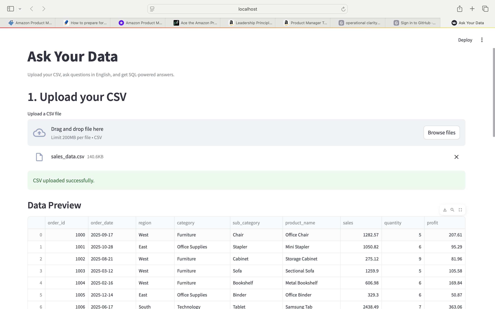
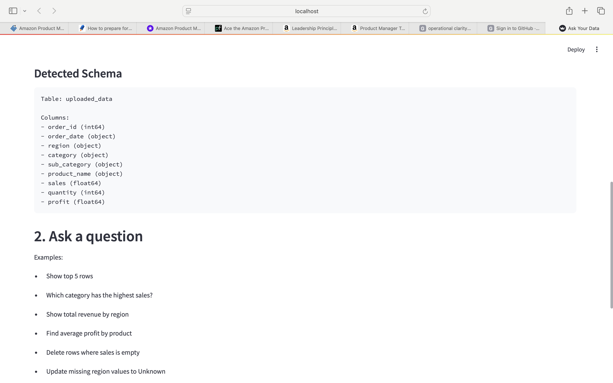
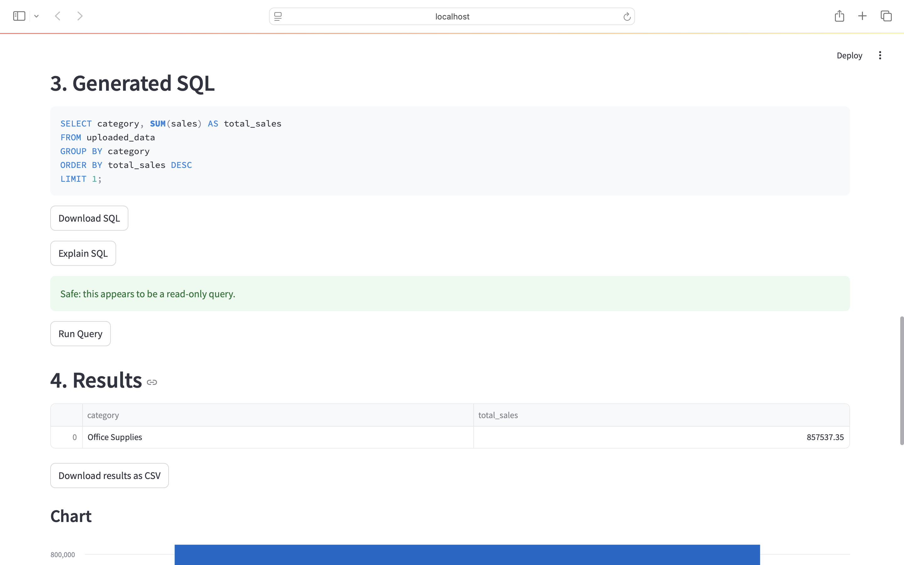
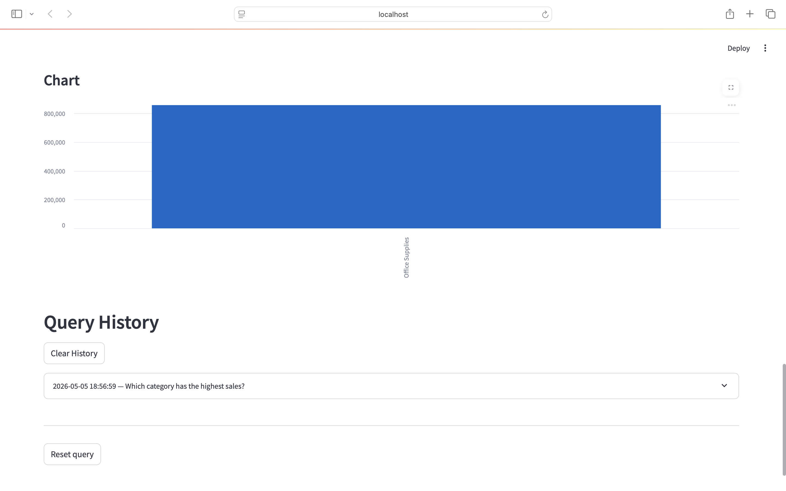

# Ask Your Data AI

Ask Your Data AI is an AI-powered analytics assistant that allows users to upload their own CSV data and query it using natural language.

The app converts English questions into SQLite queries, displays the generated SQL, warns users when a query may modify or delete data, and shows the results in a table and chart when possible.

## 🚀 Features

- Upload your own CSV file
- Natural Language → SQL conversion
- SQLite database integration
- AI-generated SQL queries
- Generated SQL is shown before execution
- Alert/warning for risky queries such as `DELETE`, `UPDATE`, `INSERT`, `DROP`, `ALTER`, and `CREATE`
- Confirmation required before running risky queries
- Interactive Streamlit UI
- Automatic table output
- Automatic chart generation for suitable results
- Reset query option while keeping the uploaded CSV active

## 🧠 How It Works

User uploads CSV

        ↓

CSV is loaded into SQLite

        ↓

App detects the table schema

        ↓

User asks a question in English

        ↓

AI generates SQL

        ↓

App displays the generated SQL

        ↓

Risk analyzer checks the SQL

        ↓

Safe queries run normally

Risky queries show a warning and require confirmation

        ↓

Results + Visualization are displayed

## 🛠️ Tech Stack

- Python
- SQLite
- Streamlit
- OpenAI API
- Pandas
- python-dotenv

## 📊 Example Queries

After uploading a CSV, users can ask:

- Show top 5 rows
- Which category has the highest sales?
- Show total revenue by region
- Find average profit by product
- Monthly sales trends
- Most profitable category
- Delete rows where sales is empty
- Update missing region values to Unknown

## 📸 Screenshots

### Upload CSV

### Ask a Question

### Generated SQL

### Results and Chart

⚠️ SQL Safety Behavior

The app does not blindly block SQL keywords.

Instead, it detects potentially risky SQL operations and warns the user before execution.

Risky operations include:

INSERT
UPDATE
DELETE
DROP
ALTER
TRUNCATE
CREATE
REPLACE
VACUUM
ATTACH
DETACH

For safe read-only queries like SELECT, the app displays the generated SQL and results normally.

For risky queries, the app displays:

- Generated SQL
- Warning message
- Detected risky keywords
- Confirmation checkbox

The risky query only runs after the user confirms that they understand the risk.

## ⚡ Setup

git clone https://github.com/nishchal-99/ask-your-data-ai.git
cd ask-your-data-ai
pip install -r requirements.txt
